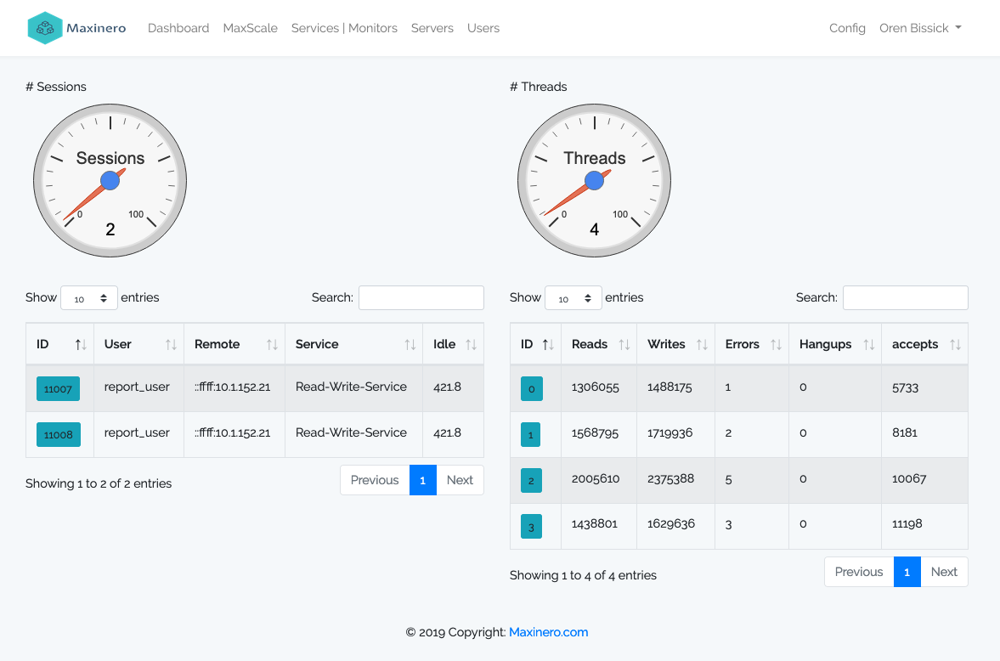
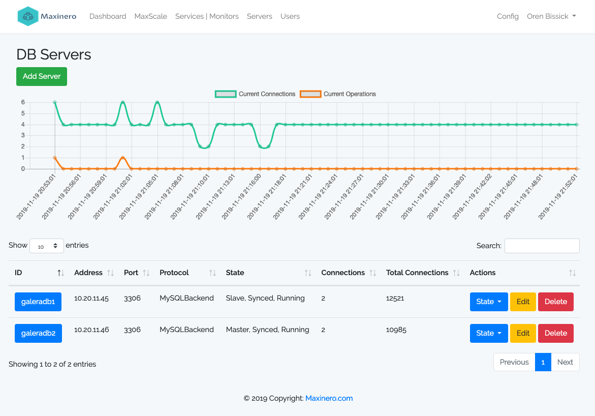
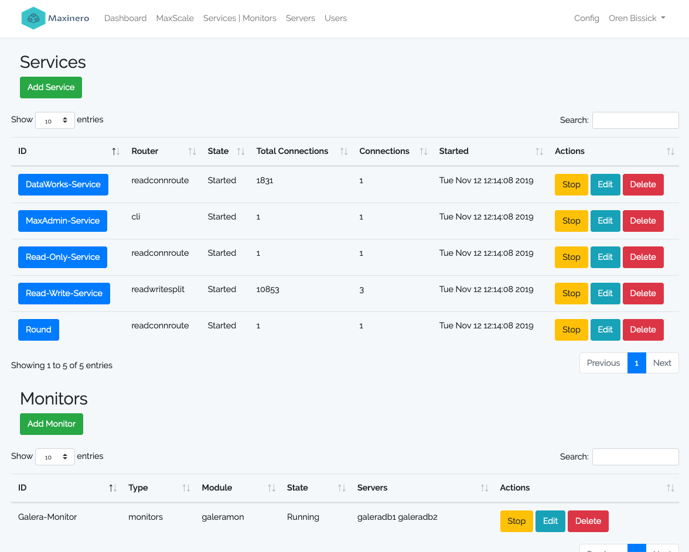
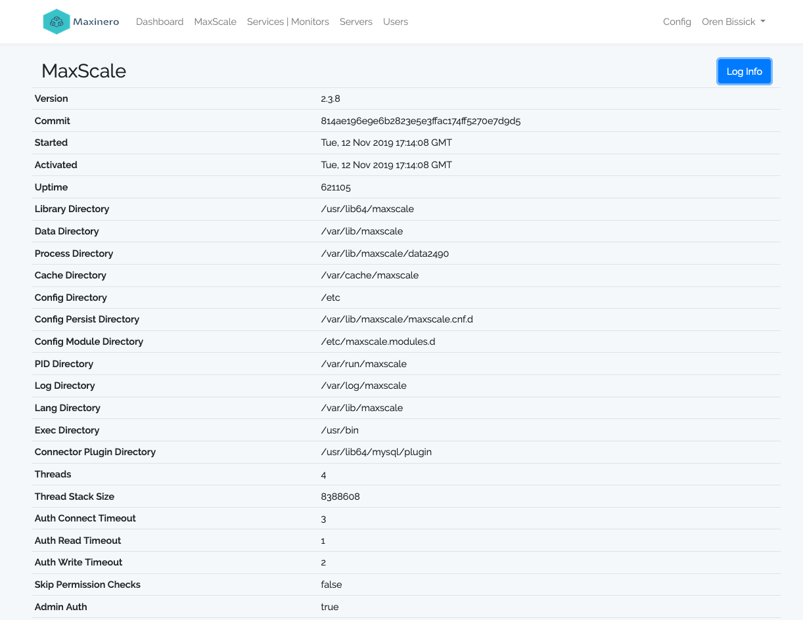
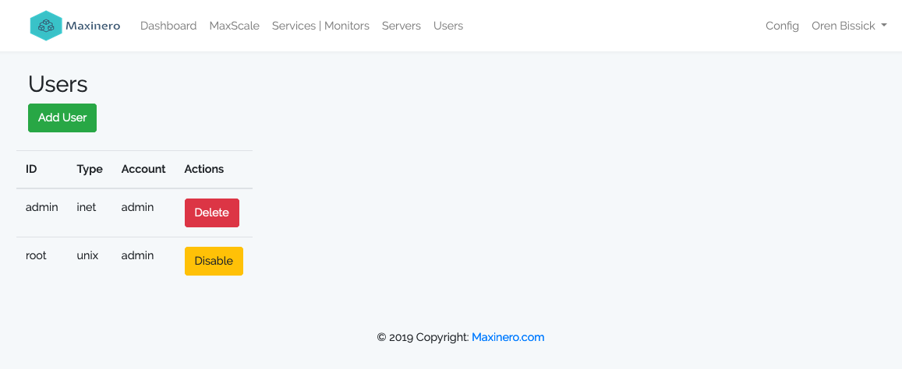
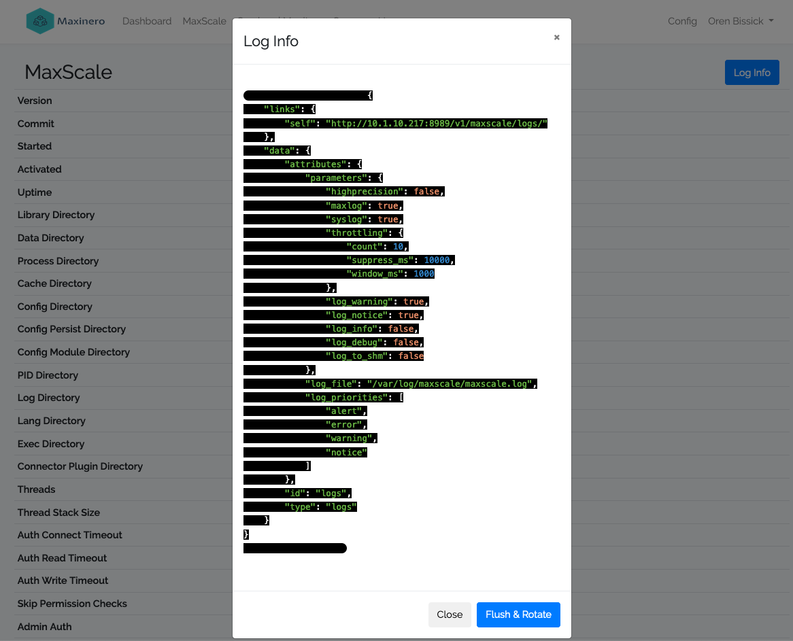

# Maxinero

A web UI for administering [MariaDB MaxScale](https://mariadb.com/kb/en/maxscale/) via its REST API. Manage multiple MaxScale instances from one interface — servers, services, monitors, listeners, users, and live connection charts.



---

## Features

- **Dashboard** — active sessions, worker threads, live connection charts
- **DB Servers** — add, edit, delete, change state (master/slave/maintenance/drain/running)
- **Services & Monitors** — start/stop, edit, manage listeners
- **MaxScale Info** — version, parameters, directories, log viewer
- **Users** — manage inet and unix MaxScale accounts
- **Multi-Instance** — add multiple MaxScale API endpoints and switch between them from the navbar
- **Per-user config** — each user manages their own set of API connections

---

## Screenshots

| Dashboard | DB Servers |
|---|---|
|  |  |

| Services & Monitors | MaxScale Info |
|---|---|
|  |  |

| Users | Log Viewer |
|---|---|
|  |  |

---

## Requirements

- PHP 8.2+
- MySQL / MariaDB
- Composer
- Node.js 18+ (for Vite build)
- Apache httpd or Nginx
- MaxScale 2.x – 24.x (REST API v1)

---

## Installation

### 1. Clone & install dependencies
```bash
git clone https://github.com/obissick/maxinero.git
cd maxinero
composer install --no-dev --optimize-autoloader
npm ci && npm run build
```

### 2. Environment
```bash
cp .env.example .env
php artisan key:generate
```

Edit `.env`:
```ini
APP_ENV=production
APP_DEBUG=false
APP_URL=https://yourdomain.com

DB_HOST=127.0.0.1
DB_DATABASE=maxinero
DB_USERNAME=maxuser
DB_PASSWORD=secret
```

### 3. Database
```bash
php artisan migrate --force
```

### 4. Permissions
```bash
chmod -R 775 storage/ bootstrap/cache/
chown -R apache:apache storage/ bootstrap/cache/   # or www-data for Nginx
```

### 5. Optimize
```bash
php artisan config:cache
php artisan route:cache
php artisan view:cache
```

---

## Web Server

### Apache httpd — `/etc/httpd/conf.d/maxinero.conf`
```apache
<VirtualHost *:80>
    ServerName yourdomain.com
    Redirect permanent / https://yourdomain.com/
</VirtualHost>

<VirtualHost *:443>
    ServerName yourdomain.com
    DocumentRoot /var/www/maxinero/public

    SSLEngine on
    SSLCertificateFile    /etc/pki/tls/certs/maxinero.crt
    SSLCertificateKeyFile /etc/pki/tls/private/maxinero.key

    <Directory /var/www/maxinero/public>
        Options -Indexes +FollowSymLinks
        AllowOverride All
        Require all granted
    </Directory>

    <FilesMatch \.php$>
        SetHandler "proxy:unix:/run/php-fpm/www.sock|fcgi://localhost"
    </FilesMatch>
</VirtualHost>
```

### Nginx — `/etc/nginx/conf.d/maxinero.conf`
```nginx
server {
    listen 443 ssl;
    server_name yourdomain.com;
    root /var/www/maxinero/public;
    index index.php;

    ssl_certificate     /etc/pki/tls/certs/maxinero.crt;
    ssl_certificate_key /etc/pki/tls/private/maxinero.key;

    location / {
        try_files $uri $uri/ /index.php?$query_string;
    }

    location ~ \.php$ {
        fastcgi_pass unix:/run/php-fpm/www.sock;
        fastcgi_param SCRIPT_FILENAME $realpath_root$fastcgi_script_name;
        include fastcgi_params;
    }
}
```

---

## Scheduler (connection stats charts)

Add to cron — stats are collected every minute:
```bash
echo "* * * * * apache cd /var/www/maxinero && php artisan schedule:run >> /dev/null 2>&1" \
    | sudo tee /etc/cron.d/maxinero
```

---

## Connecting to MaxScale

After logging in, go to **Config** (user dropdown) and add a MaxScale API endpoint:

| Field | Example |
|---|---|
| Name | Production |
| API URL | `http://<IP Address>:8989/v1/` |
| Username | `admin` |
| Password | `password` |

Multiple endpoints can be added and switched from the top navigation bar.

---

## Tech Stack

- Laravel 11
- Bootstrap 5.3
- Chart.js 4
- Vite 6
- DataTables 1.13
- Guzzle (MaxScale REST API client)

---

## License

MIT

